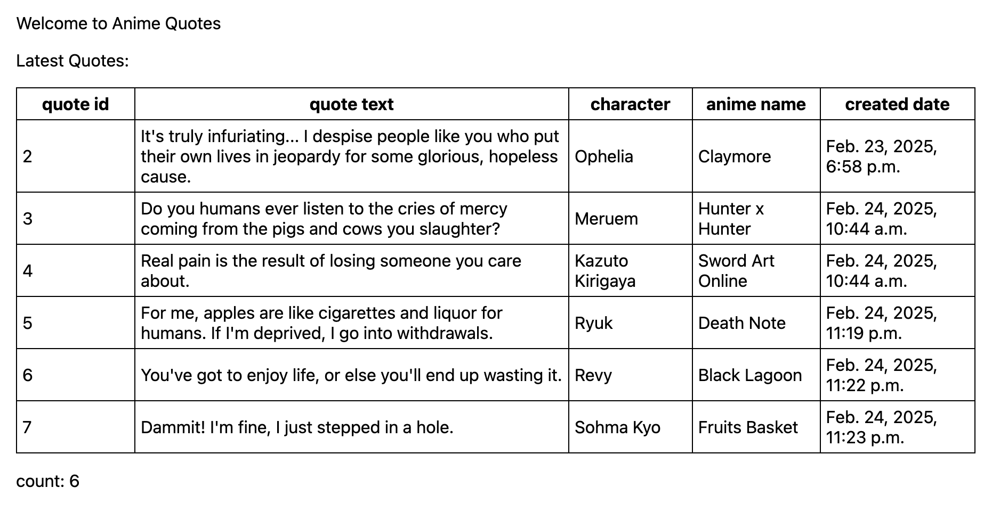
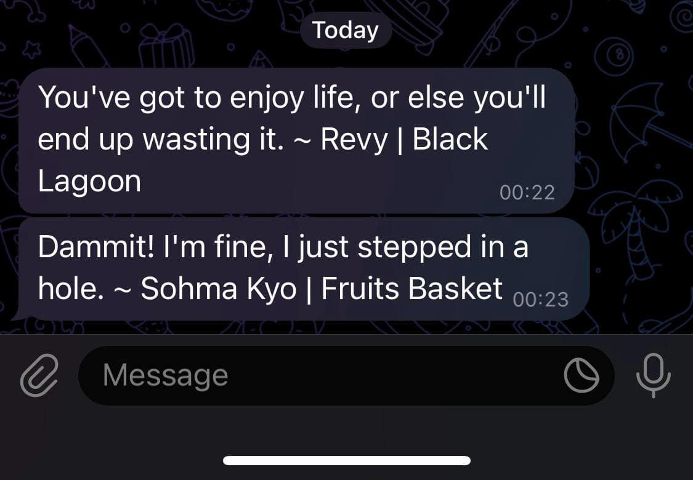

# py-dj-ani-tg-api

### description:
simple web app written in django with postgreSQL adapter  

### stack:
- python, django
- db: postgresql
- services: animechan, telegram

### functionality:
- get random anime quote
- save it to database with api's metadata
- show saved quotes in table on frontend
- send the quote via telegram to user

### app view:
  

### telegram view:
